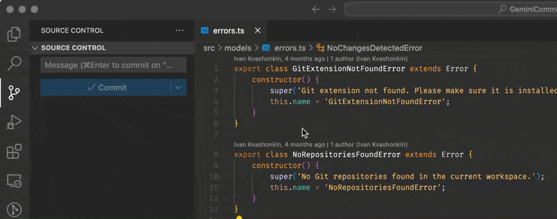

# Commit Sage (formerly GeminiCommit)

   

Commit Sage is a VSCode extension that automatically generates commit messages using Google's Gemini AI or an OpenAI API endpoint (OpenAI, Ollama, LocalAI and others).

## Features

- 🤖 AI-powered commit message generation
- 🔄 Support for both Google's Gemini and custom OpenAI-compatible endpoints
- 🌐 Multiple languages support
- 🎯 Customizable commit message format
- ⚡ Fast and efficient
- 🔒 Secure API key storage
- 🎨 Custom instructions support
- 🚀 Auto commit and push support

## Installation

1. Install from [VS Code Marketplace](https://marketplace.visualstudio.com/items?itemName=VizzleTF.commitsage)
2. Get your API key:
   - For Gemini: Get it from [Google AI Studio](https://makersuite.google.com/app/apikey)
   - For custom endpoint: Use your OpenAI API key or other compatible service
3. Set up the API key in VS Code:
   - Open Command Palette (Ctrl+Shift+P / Cmd+Shift+P)
   - Type "Commit Sage: Set Gemini API Key" or "Commit Sage: Set Custom API Key"
   - Enter your API key

## Usage

1. Write code
2. Press button in Source control
4. Review and confirm generated message

## Configuration

### Commit Settings

- **Commit Language** (`commitSage.commit.commitLanguage`):
  - Language for generated commit messages
  - Default: English

- **Commit Format** (`commitSage.commit.commitFormat`):
  - Format style for commit messages
  - Options: Conventional, Angular, Karma, Semantic, Emoji
  - Default: Conventional

### Custom Instructions

- Enable with `commitSage.commit.useCustomInstructions`
- Set instructions in `commitSage.commit.customInstructions`
- Allows full control over the AI prompt

### Git Integration

- **Prompt for Refs** (`commitSage.commit.promptForRefs`):
  - Ask for issue/PR references
  - Default: false

- **Only Staged Changes** (`commitSage.commit.onlyStagedChanges`):
  - Use only staged changes for message generation
  - Default: false
  - When disabled: uses staged changes if present, otherwise all changes

- **Auto Commit** (`commitSage.commit.autoCommit`):
  - Automatically commit after message generation
  - Default: false

- **Auto Push** (`commitSage.commit.autoPush`):
  - Push changes after auto commit
  - Default: false
  - Requires Auto Commit to be enabled

### AI Model Settings

- **Gemini Model** (`commitSage.gemini.model`):
  - Model for Gemini API
  - Available free models:
    - `gemini-1.0-pro`: Base model, good for general use
    - `gemini-1.5-pro`: Enhanced version with better understanding
    - `gemini-1.5-flash`: Optimized for speed (default)
    - `gemini-2.0-flash-exp`: Experimental model with latest improvements
  - Default: gemini-1.5-flash

### Custom Endpoint Settings

- **Use Custom Endpoint** (`commitSage.custom.useCustomEndpoint`):
  - Use alternative AI provider
  - Default: false

- **Custom Endpoint URL** (`commitSage.custom.endpoint`):
  - API endpoint for custom provider
  - Example: https://api.openai.com/v1

- **Custom Model** (`commitSage.custom.model`):
  - Model name for custom endpoint
  - Example: gpt-3.5-turbo

### Telemetry

- **Telemetry** (`commitSage.telemetry.enabled`):
  - Usage data collection (only counts commits without any other information)
  - Default: true
  - Helps improve the extension

## Support

- [Telegram Channel](https://t.me/geminicommit) - Release announcements and updates
- [Telegram Group](https://t.me/gemini_commit) - Community discussions and support

## Contributing

- Report issues on [GitHub Issues](https://github.com/VizzleTF/CommitSage/issues)
- Pull requests are welcome!

## License

MIT

---

# Commit Sage (на русском)

Commit Sage - расширение VSCode для автоматической генерации сообщений коммитов с использованием Gemini AI от Google или OpenAI API (OpenAI, Ollama, LocalAI и другие).

## Установка

1. Установите из [VS Code Marketplace](https://marketplace.visualstudio.com/items?itemName=VizzleTF.commitsage)
2. Получите API ключ:
   - Для Gemini: [Google AI Studio](https://makersuite.google.com/app/apikey)
   - Для других: Используйте ключ от OpenAI или другого совместимого сервиса
3. Настройте ключ в VS Code:
   - Откройте палитру команд (Ctrl+Shift+P / Cmd+Shift+P)
   - Введите "Commit Sage: Set Gemini API Key" или "Commit Sage: Set Custom API Key"
   - Введите ваш API ключ

## Использование

1. Добавьте изменения в Git (git add)
2. Откройте палитру команд (Ctrl+Shift+P / Cmd+Shift+P)
3. Введите "Commit Sage: Generate Commit Message"
4. Проверьте и подтвердите сгенерированное сообщение

## Настройка

Все настройки доступны через:
- Палитра команд → "Preferences: Open Settings (UI)"
- Поиск "Commit Sage"

## Поддержка

- [Telegram Канал](https://t.me/geminicommit) - Анонсы обновлений
- [Telegram Группа](https://t.me/gemini_commit) - Обсуждения и помощь
